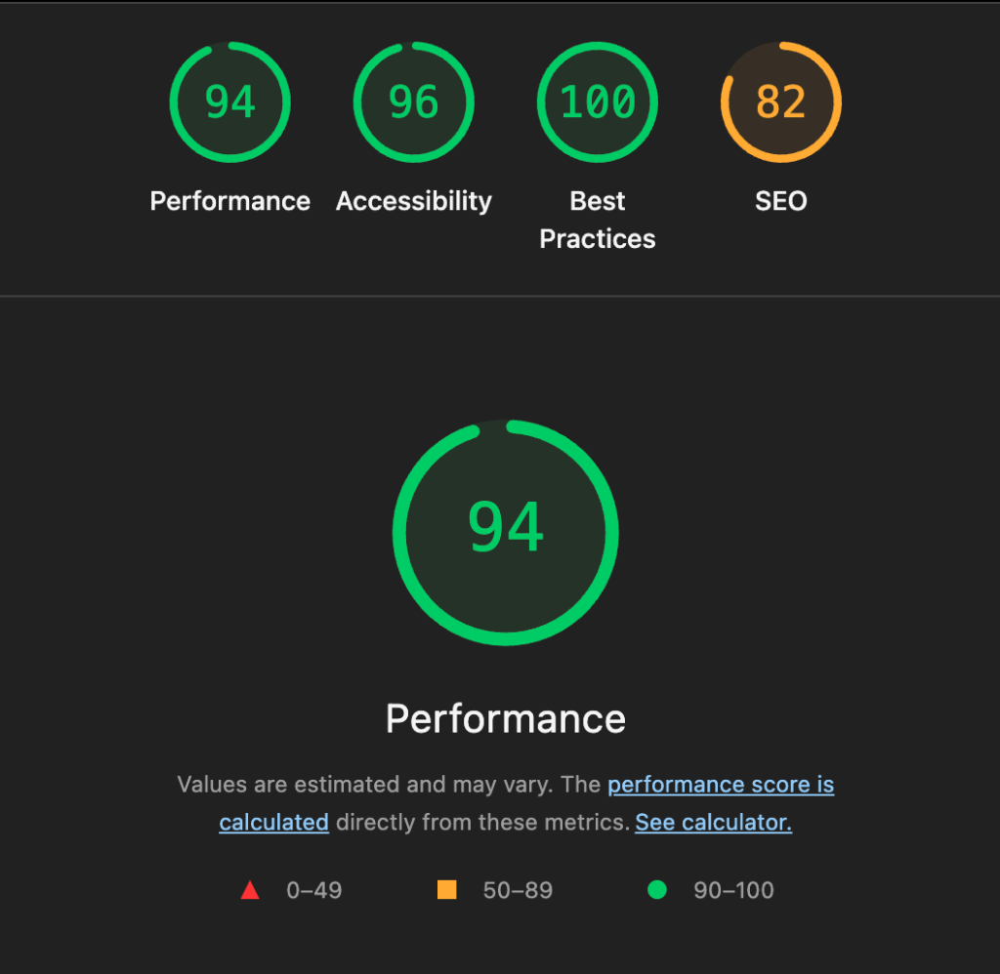

# Web LAB-1 & LAB-2 - The IT Girl Edition

✨ **Spotted at Upper East Side: A Premium Web Portfolio** ✨

This project has been upgraded to a premium **Gossip Girl** theme, combining high-fashion aesthetics with elite accessibility standards.

## Project Status: Elite

- **Aesthetic**: Gold, Black, and Soft Cream palette. Elegance meets code.
- **Accessibility (a11y)**: Lighthouse Audit Score: **96/100**.
- **Performance**: Lighthouse Audit Score: **94/100**.

### Lighthouse Report

## Highlights

- **Thematic content**: Personalized bio, project diary, and a clandestine "Gossip Box" contact form.
- **Interactivity**: The IT girl knows her secrets. Clicking any navigation link (Spotted, Details, Confess) triggers the elite **"Add Skip Main Content"** link visibility.
- **Semantic HTML5**: Native elements (`header`, `nav`, `main`, `section`, `article`, `footer`) for a structured digital presence.

## LAB-1 Kendini Test Et (Soru & Cevap)

1. **Terminal nedir ve neden GUI yerine terminal kullanılır?**
   - Terminal, bilgisayarı metin komutlarıyla yönettiğimiz bir arayüzdür. GUI yerine terminal kullanmak hız, otomasyon (scripting), standartlaştırma (her OS'ta benzer komutlar) ve geliştirme araçlarının (Git, npm, Vite) gücüne tam erişim sağlar.
2. **Node.js ne işe yarar? Tarayıcı zaten JavaScript çalıştırıyorsa neden Node.js’e ihtiyacımız var?**
   - Node.js, JavaScript'in tarayıcı dışında, işletim sistemi üzerinde çalışmasını sağlar. Geliştirme araçlarının (Vite, webpack gibi) çalışması ve backend işlemleri için gereklidir.
3. **npm ne yapar? package.json dosyasının rolü nedir?**
   - npm, projeye hazır kütüphaneler (paketler) indirmeyi ve yönetmeyi sağlar. `package.json` ise projenin "nüfus kağıdı" gibidir; bağımlılıklar, versiyonlar ve komutlar burada tanımlanır.
4. **node_modules klasörü neden GitHub’a yüklenmez?**
   - Bu klasör çok büyüktür ve `package.json` sayesinde her ortamda `npm install` ile kolayca yeniden oluşturulabilir. Repoyu şişirmemek için `.gitignore` ile hariç tutulur.
5. **Git’te commit ne demektir? Neden sık sık commit atmalıyız?**
   - Commit, kodun o anki halinin "kayıt noktası"dır. Sık commit atmak hataları geri almayı kolaylaştırır ve projenin gelişim tarihçesini detaylı takip etmemizi sağlar.

## LAB-2 Kendini Test Et (Soru & Cevap)

1. **Semantik HTML ne demektir? div ile section arasındaki fark nedir?**
   - Semantik HTML, etiketlerin sadece görünümü değil, içeriğin anlamını da ifade etmesidir. `div` genel bir kapsayıcıyken ve anlamsızken, `section` tematik olarak ayrılmış, belirli bir başlığı olan bir bölümü ifade eder.
2. **main etiketi neden sayfada yalnızca bir kez kullanılmalıdır?**
   - `main`, sayfanın birincil ve benzersiz içeriğini sarmaladığı için standart gereği tektir. Ekran okuyucular doğrudan ana içeriğe atlamak için bu etiketi referans alır.
3. **Erişilebilirlik (a11y) nedir ve kimler yararlanır?**
   - Web içeriğinin herkes (görme, işitme, motor veya bilişsel engelli bireyler dahil) tarafından algılanabilir ve kullanılabilir olmasıdır. Yaşlılar, geçici engeli olanlar ve klavye kullanıcıları da dahil herkes yararlanır.
4. **Heading hiyerarşisinde seviye atlamak neden sorunludur?**
   - Ekran okuyucu kullanıcıları başlıklar üzerinden sayfa yapısını anlar. `h1`'den sonra `h3`'e atlamak, yapının kopuk algılanmasına ve navigasyonun zorlaşmasına sebep olur.
5. **alt="" ile alt özniteliğini hiç yazmamak arasındaki fark nedir?**
   - `alt=""` yazmak, görselin sadece dekoratif olduğunu ve ekran okuyucunun bunu geçebileceğini bildirir. Hiç yazmamak ise hata olarak kabul edilir ve ekran okuyucu dosya adını okuyarak kullanıcıyı rahatsız edebilir.

---
## Gelistirici
- **Ad Soyad:** Zeliha Sena Güllü
- **Ogrenci No:** 235541048

## Kullanilan Teknolojiler
- **React 18 & TypeScript**: For exclusive logic.
- **Vite**: For high-speed delivery.
- **Google Fonts**: Playfair Display & Montserrat.

---
*You know you love me, XOXO.* 💋
